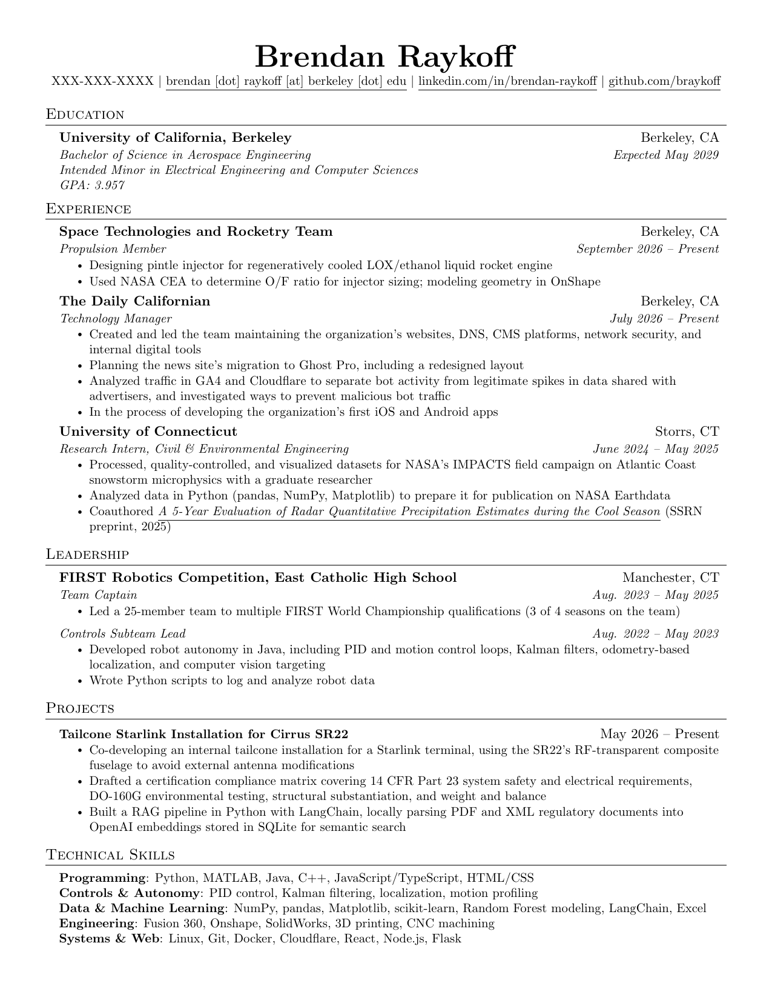

# resume
LaTeX template for my personal resume

Based off of [sb2nov/resume](https://github.com/sb2nov/resume/) and [jakegut/resume](https://github.com/jakegut/resume)


## Building

`resume.tex` keeps private info (phone number, email) out of the source as
`{{ secret.PHONE_NUMBER }}` / `{{ secret.EMAIL }}` placeholders, filled in at
compile time from a local `.env` file (copy `.env.example` to `.env` and fill
in real values) by [secret-latex](https://github.com/braykoff/secret-latex).
Install it with `pip install secret-latex`, then either point your editor at it
(see its [install docs](https://github.com/braykoff/secret-latex/tree/main/install))
or build from the command line:

```sh
secret-latex build resume.tex
```

<!-- BEGIN RESUME PREVIEW -->
## Resume Preview



<!-- END RESUME PREVIEW -->
